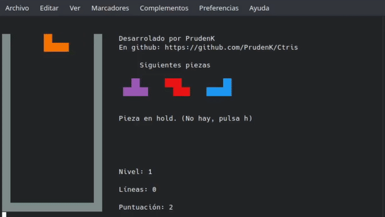

# 🧩 Ctris

[](https://wakatime.com/badge/user/72f82c75-11de-43fd-979a-a5efbf06f882/project/5d77bc21-1291-4ac7-b1f1-669014e062fc)

**Ctris** es una implementación en C del clásico **Tetris**, usando programación estructurada con técnicas de orientación a objetos simuladas (con `structs` y `vtables`).
Está hecho para jugarse en terminal desde linux.

---

## 🎮 Para jugar

1. 🔽 **Clona el repositorio**
   ```bash
   git clone https://github.com/PrudenK/Ctris.git
   ```

2. 🛠️ **Abre tu archivo `.bashrc`**
   ```bash
   nano ~/.bashrc
   ```

3. 🧩 **Añade este alias** (ajusta la ruta a tu proyecto):
   ```bash
   alias ctris='cmake -S ~/CLionProjects/Ctris -B ~/CLionProjects/Ctris/build && cmake --build ~/CLionProjects/Ctris/build && ~/CLionProjects/Ctris/build/Ctris'
   ```

4. 🔄 **Aplica los cambios**
   ```bash
   source ~/.bashrc
   ```

5. 🚀 **Ejecuta `ctris` en tu terminal y juega**

## 🖥️ Cómo se ve en el terminal

<div align="center">
  
</div>